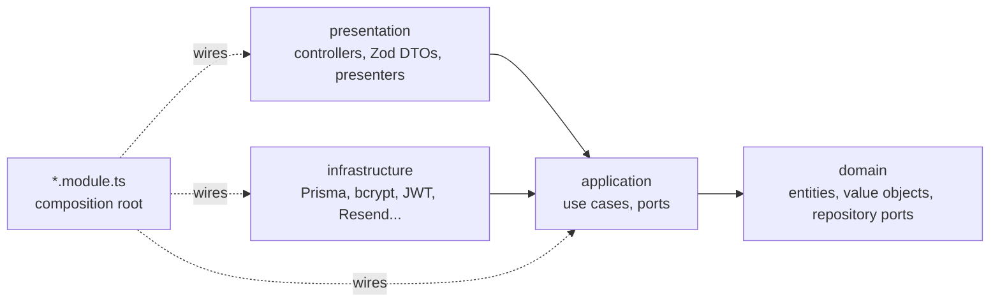
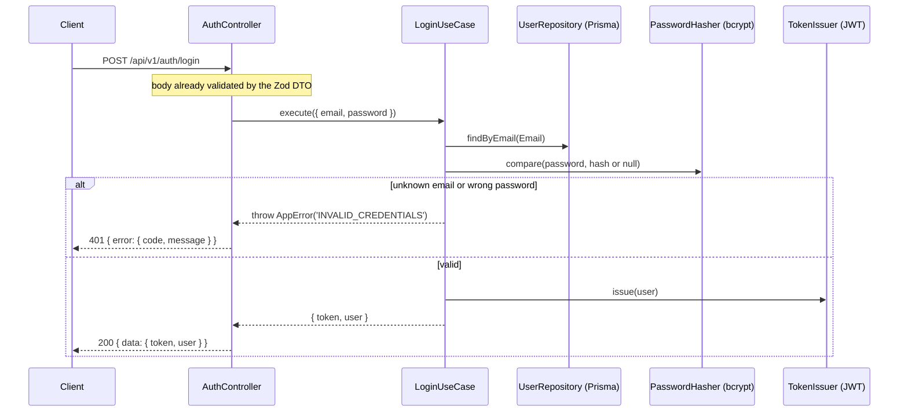

# events-api

> Multi-event REST API behind event websites (weddings, birthdays, corporate events, showers): RSVPs, a gift registry paid via Pix, and guest emails. Successor to [`fawedding-api`](https://github.com/penteado40/fawedding-api), which only served weddings.

[](https://github.com/penteado40/events-api/actions/workflows/ci.yml)


## Overview

Each **Event** is a tenant with its own public **Site**. Guests confirm attendance (**RSVP**) and contribute to **Registry items** via Pix; event members (Owner, Manager, Viewer) run the event behind a login, and a Super admin manages the platform. The full vocabulary lives in the domain glossary, [`CONTEXT.md`](CONTEXT.md).

The project is also a showcase of **Clean Architecture with pragmatic DDD on NestJS**, where the dependency rule is enforced by the linter rather than by discipline.

> The domain docs ([`CONTEXT.md`](CONTEXT.md), [ADRs](docs/adr), [`docs/arquitetura.md`](docs/arquitetura.md)) are written in Portuguese.

## Status

V1 is under construction. Working today:

- Login with JWT (`POST /api/v1/auth/login`) and the current user (`GET /api/v1/me`), with sessions revoked on password change
- The `identity` module, the reference implementation of the architecture
- Stable error contract, security headers, OpenAPI + Scalar docs
- Unit and integration tests, CI with migration drift check and secret scanning

Roadmap and tasks: Jira epic [PROJ-51](https://flpenteado.atlassian.net/browse/PROJ-51). The V1 PRD is [issue #1](https://github.com/penteado40/events-api/issues/1).

## Architecture

One NestJS module per bounded context: `identity` (Users, login), `events` (Events, members, API tokens, access policy), `rsvp`, `registry` (Registry items, Contributions) and `emails`, plus `shared` for the common base. Each module has the same four layers, and **dependencies only point inward**:



- `domain` and `application` are plain TypeScript: no NestJS, Prisma or Zod. Ports are `abstract class`es that double as injection tokens; the module file binds each port to its adapter.
- Modules talk to each other only through their `index.ts`.
- ESLint enforces all of it (`eslint-plugin-boundaries` + `no-restricted-imports`), in the editor and in CI, and a test checks the rules themselves still fire.

How a login request flows through the layers:



The full explanation, with examples from this codebase: [`docs/arquitetura.md`](docs/arquitetura.md).

## Key technical decisions

Each one is recorded as an ADR in [`docs/adr/`](docs/adr).

- **NestJS, with Zod as the single source of validation and OpenAPI** ([ADR-0009](docs/adr/0009-nestjs.md)). `nestjs-zod` DTOs validate requests and generate the docs, so the two never drift apart.
- **Stable error codes** ([ADR-0008](docs/adr/0008-contrato-da-api.md)). The domain throws `AppError` with a code only; one global filter maps it to an HTTP status and a Portuguese message, so Sites choose their text by code.
- **Vercel Functions + Upstash Redis** ([ADR-0007](docs/adr/0007-vercel-functions-e-upstash.md)). Serverless instead of an always-on server; rate-limit counters live in Redis because each instance has its own memory.
- **In-process domain events, published after commit** ([ADR-0010](docs/adr/0010-domain-events-em-processo.md)). Contexts react to facts (an RSVP confirmed, then an email sent) without an outbox; delivery is best effort.
- **New database with a full migration** ([ADR-0001](docs/adr/0001-nova-api-banco-novo-migracao-completa.md)), **keeping the old integer ids** ([ADR-0002](docs/adr/0002-ids-inteiros-preservados.md)) so Sites only change their URL prefix.

## API

| Method | Path | Auth | Description |
|---|---|---|---|
| `POST` | `/api/v1/auth/login` | public | Email + password → JWT (12h) and the User |
| `POST` | `/api/v1/auth/activate` | public | Activation token + new password → JWT and the User |
| `GET` | `/api/v1/me` | JWT | The authenticated User |
| `PATCH` | `/api/v1/me/password` | JWT | Current + new password → new JWT; older sessions are revoked |
| `POST` | `/api/v1/users` | Super admin | Creates a Pending user; returns the Activation token (valid 7 days) |
| `POST` | `/api/v1/users/:id/activation-link` | Super admin | New Activation token for a Pending user; the previous one stops working |

Every other route requires a JWT by default (a global guard; public routes opt out explicitly). The full, always-current reference is generated from the code: Scalar at `/api/v1/docs` and the OpenAPI document at `/api/v1/openapi`, both enabled with `DOCS_ENABLED=true` (off in production). Every route shows a summary, the error codes it can answer and a request body that works against the local seed; `test/integration/docs.spec.ts` fails the build when a route skips any of them.

Responses use `{ data }` on success and a stable error envelope otherwise:

```json
{ "error": { "code": "VALIDATION_ERROR", "message": "Dados inválidos.", "details": [{ "path": "email", "message": "Invalid email address" }] } }
```

## Tech stack

Node 22 · TypeScript (ESM, `strict`) · NestJS 11 · Zod (`nestjs-zod`) + `@nestjs/swagger` + Scalar · Passport JWT · Prisma 7 with `@prisma/adapter-pg` · PostgreSQL (Neon in production) · Vitest + supertest · ESLint + Prettier · GitHub Actions · Vercel Functions. Coming with V1: Upstash Redis, Resend + React Email, Cloudinary.

## Getting started

**Prerequisites:** Node 22 (`.nvmrc`) and a local PostgreSQL 16 or newer (CI and production run 17) with a role that can create databases (Prisma's `migrate dev` needs a shadow database):

```sql
CREATE USER events_api WITH PASSWORD 'events_api123' CREATEDB;
CREATE DATABASE events_api_db OWNER events_api;
CREATE DATABASE events_api_test OWNER events_api;
```

```bash
nvm use
cp .env.example .env
npm install                  # also runs prisma generate
npx prisma migrate deploy
npx prisma db seed           # local Super admin: admin@local.test / Admin-local-123
npm run dev                  # http://localhost:3000/api/v1
```

A database seeded before PROJ-98 keeps the old `admin-local-123`, since the seed never overwrites a password. Reset it once with `npm run create-super-admin -- --email=admin@local.test --name="Super admin local" --password=Admin-local-123 --reset-password`.

With `DOCS_ENABLED=true`, open `http://localhost:3000/api/v1/docs` and log in with the seeded Super admin through the Authorize button.

### Environment variables

| Variable | Description |
|---|---|
| `NODE_ENV` | `development`, `test` or `production`. Production hides internal error messages and closes CORS. |
| `PORT` | Local port (default `3000`) |
| `DATABASE_URL` | PostgreSQL connection (the pooled URL on Neon) |
| `DATABASE_URL_TEST` | Database for the integration tests; it is truncated before each test file |
| `SHADOW_DATABASE_URL` | Optional; only for the migration drift check |
| `JWT_SECRET` | At least 32 characters (`openssl rand -base64 48`) |
| `DOCS_ENABLED` | `true` registers the docs, the OpenAPI document and `POST /auth/token` |
| `ACTIVATION_LINK_TTL` | Optional; Activation link lifetime in seconds (default `604800`, 7 days) |

## Development

| Script | What it does |
|---|---|
| `npm run dev` | Compiles in watch mode and restarts the server |
| `npm run typecheck` | `tsc --noEmit` over everything, including tests, scripts and the Vercel entry |
| `npm run lint` | ESLint (with the architecture rules) + Prettier check |
| `npm run test:unit` | Unit tests and the architecture lint tests, no database |
| `npm run test:integration` | HTTP tests against the real Postgres in `DATABASE_URL_TEST` |
| `npm run prisma:migrate` | Creates a migration from `prisma/schema.prisma` |
| `npm run create-super-admin -- --email=... --name=... --password=... [--reset-password]` | Creates or promotes the Super admin (idempotent; the password follows the PasswordPolicy, ADR-0012) |

**Tests.** Use cases are unit-tested with in-memory fakes of their ports (no database). Integration tests boot the real app with `@nestjs/testing` and hit it through supertest against PostgreSQL, running migrations once and truncating every table before each file.

**CI** runs three parallel jobs on every PR and on pushes to `main`: `checks` (typecheck, lint, `prisma validate`, unit tests, build), `integration` (Postgres 17 service, migrations, schema-vs-migrations drift check, integration tests) and `gitleaks` (secret scanning over the full history). Dependabot groups minor and patch updates.

**Adding a feature.** Follow the `identity` module. The repo ships a Claude Code skill, [`new-use-case`](.claude/skills/new-use-case/SKILL.md), that walks through a use case from domain to endpoint, test first.

### Project structure

```
src/
  modules/identity/     # reference module: domain, application, infrastructure, presentation
  shared/               # AppError, Email, PrismaService, config, error filter, JWT guard
  app.module.ts         # root module
  main.ts               # local entry
api/index.ts            # Vercel Functions entry (same AppModule)
prisma/                 # schema, migrations, seed
scripts/                # create-super-admin
test/integration/       # HTTP tests against Postgres
test/architecture/      # tests for the architecture lint rules
docs/                   # architecture guide, ADRs
```

## Deployment

Pushes to `main` deploy to production on Vercel Functions (Node.js runtime, `iad1`); every other branch and PR gets a preview deployment, sharing a separate database branch (`dev`) and with the docs enabled. `api/index.ts` runs the same `AppModule` as `src/main.ts`, creating the app once per instance and reusing it across invocations.

Environments, services (Neon, Upstash, Resend, Cloudinary), how to run migrations and known limitations: [`docs/infra.md`](docs/infra.md) (in Portuguese).
